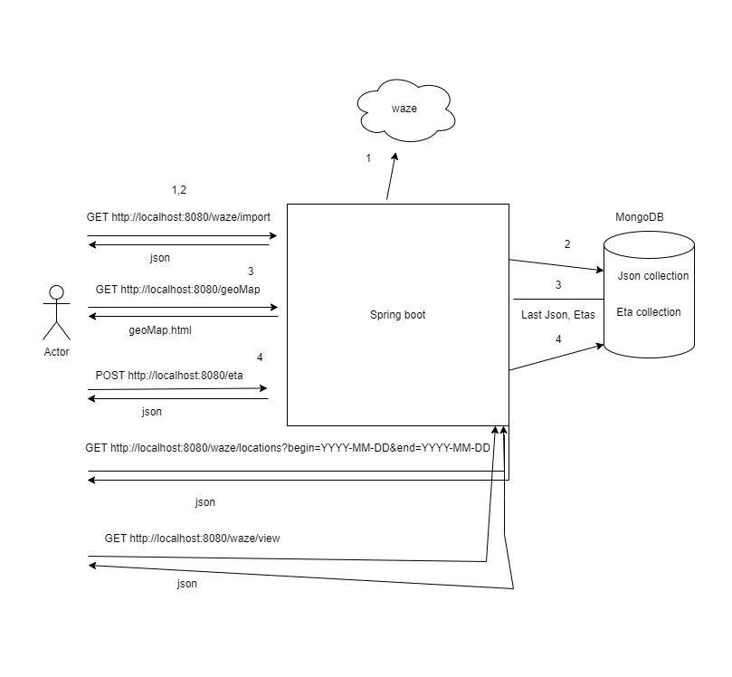

OSM :
GET https://cloud.mongodb.com/v2/66a24fd05870bf7479feae91#/metrics/replicaSet/66a270ecf1dc246c84649aac/explorer/mygrocerylist/groceryitems/find

TEST
GET http://localhost:8080/waze/file

===========================================================
REST API:

1. Import from waze api :
GET http://localhost:8080/waze/import

2. Add ETA (date yyyy-MM-dd) for a location
POST http://localhost:8080/eta
{
"type":"HAZARD",
"subtype":"HAZARD_ON_ROAD_POT_HOLE",
"location": {
"x": 23.682509,
"y": 46.78109
},
"date":"2024-08-01"
}

3. Filter between start date and end date
GET http://localhost:8080/waze/locations?begin=2024-08-01&end=2024-08-01

4. Get last json from db
GET http://localhost:8080/waze/view

5. MVC API: 
Displays the locations from the last json from database.
Locations are displayed in different colours based on the type (HAZARD, JAM)
along with the address and eta date (if exists)
GET http://localhost:8080/mvc/geoMap

6. GET http://localhost:8080/mvc/filter?startDate=2024-08-23&endDate=2024-08-26
Displays the locations from the last json from database.
Locations are displayed in different colours based on the type (HAZARD, JAM)
along with the address and eta date (if exists) but filtered by start date
and end date
7. POST 

Technologies
BE: java17, mongodb, spring boots, spring MVC and Thymeleaf
UI: Leaflet, javascript, html, css

- Thymeleaf is a Java template engine for processing and creating HTML, XML, JavaScript, CSS and text.
(templates/geoMap.html)
- The Spring Web model-view-controller (MVC) framework is designed around a DispatcherServlet that dispatches requests to handlers, 
with configurable handler mappings, view resolution, locale and theme resolution as well as support for uploading files. 
- The default handler is based on the @Controller and @RequestMapping annotations.
- Leaflet is the open-source JavaScript library for mobile-friendly interactive maps. 

